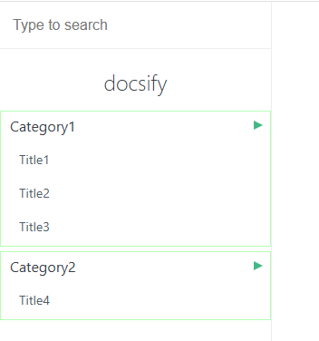

# docsify-sidebar-plus

[中文文档](README_CN.md)

[]() []()

## Introduction
`docsify-sidebar-plus` is a plugin designed to enhance the left sidebar of docsify. It offers additional customization options and features, making document navigation more flexible and powerful.

## Features
1. **Multi-level Menu Support**: Supports unlimited levels of nested menus.
2. **Custom Styling**: Allows customizing the appearance of the menu via CSS.
3. **Dynamic Loading**: Supports asynchronous loading of menu content.
4. **Search Integration**: Seamlessly integrates with docsify's search plugin.
5. **Responsive Design**: Adapts to devices of different screen sizes.

## Usage

  ```html
  
    <!-- Docsify v4 -->
  <script src="//cdn.jsdelivr.net/npm/docsify@4"></script>
  
  <script src="https://cdn.jsdelivr.net/npm/docsify-sidebar-plus@1.1.0/collapsible-sidebar.min.js"></script>
  
    <!-- Other scripts -->
  
  ```

## Directory Format
```markdown
* Category1
  * [Title1](/path1)
  * [Title2](/path2)
  * [Title3](/path3)
* Category2
  * [Title4](/path4)
```

### preview




## Contribution
Feel free to submit Issues or Pull Requests to improve this plugin.