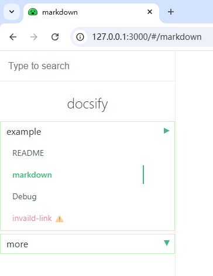

# docsify-sidebar-plus

[中文文档](README_CN.md)

[]() []()

## Introduction
`docsify-sidebar-plus` is a plugin designed to enhance the left sidebar of docsify. It offers additional customization options and features, making document navigation more flexible and powerful.

## Features
1. **Multi-level Menu Support**: Supports nested multi-level menus.
2. **Customizable Styles**: Allows customization of menu appearance through CSS.
3. **Dynamic Loading**: Supports asynchronous loading of menu content.
4. **Invalid Link Configuration**: Configurable prompt titles and styles for invalid links.
5. **Search Integration**: Seamlessly integrates with docsify's search plugin.
6. **Responsive Design**: Adapts to devices with different screen sizes.

## Usage

  ```html
  
    <!-- Docsify v4 -->
  <script src="//cdn.jsdelivr.net/npm/docsify@4"></script>
  
  <script src="https://cdn.jsdelivr.net/npm/docsify-sidebar-plus@1.2.2/collapsible-sidebar.min.js"></script>
  
    <!-- Other scripts -->
  
  ```

## Directory Format
```markdown
* Category1
  * [Title1](/path1)
  * [Title2](/path2)
  * [Title3](/path3)
* Category2
  * [Title4](/path4)
```

Or format like bellow

```markdown
- Category1
  - [Title1](/path1)
  - [Title2](/path2)
  - [Title3](/path3)
- Category2
  - [Title4](/path4)
```

### preview



## Configuration

```js

window.$docsify = {

    // Other configurations

      sidebarPlus: {  // Plugin configuration
        expireMinutes: 60, // Duration for remembering sidebar scroll position (minutes), default 60 minutes
        invalidLinkTitle: 'invaild link', // Invalid link prompt title, default 'invaild link'
        invalidLinkStyle: 'alert',  // Invalid link prompt style, default 'alert', options: show/alert/hide
        linkCheckCacheTime: 10,   // Asynchronous link availability check cache time (minutes), default 10 minutes
      }

  // Other configurations

}

```

## Contribution
Feel free to submit Issues or Pull Requests to improve this plugin.