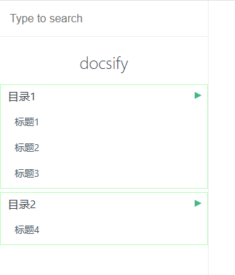

# docsify-sidebar-plus

[English Documentation](README.md)

[]() []()

## 简介
`docsify-sidebar-plus` 是一个用于增强 docsify 左侧菜单栏的插件。它提供了更多自定义选项和功能，使文档的导航更加灵活和强大。

## 功能特性
1. **多级菜单支持**：支持无限层级的菜单嵌套。
2. **自定义样式**：允许通过 CSS 自定义菜单的外观。
3. **动态加载**：支持异步加载菜单内容。
4. **搜索集成**：与 docsify 的搜索插件无缝集成。
5. **响应式设计**：适配不同屏幕尺寸的设备。

## 使用方法

   ```html

     <!-- Docsify v4 -->
  <script src="//cdn.jsdelivr.net/npm/docsify@4"></script>

  <script src="https://cdn.jsdelivr.net/npm/docsify-sidebar-plus@1.1.0/collapsible-sidebar.min.js"></script>

     <!-- 其他脚本 -->

   ```


## 目录格式
```markdown
* 目录1
  * [标题1](/路径1)
  * [标题2](/路径2)
  * [标题3](/路径3)
* 目录2
  * [标题4](/路径4)
```

## 效果截图


## 贡献
欢迎提交 Issue 或 Pull Request 来改进此插件。
